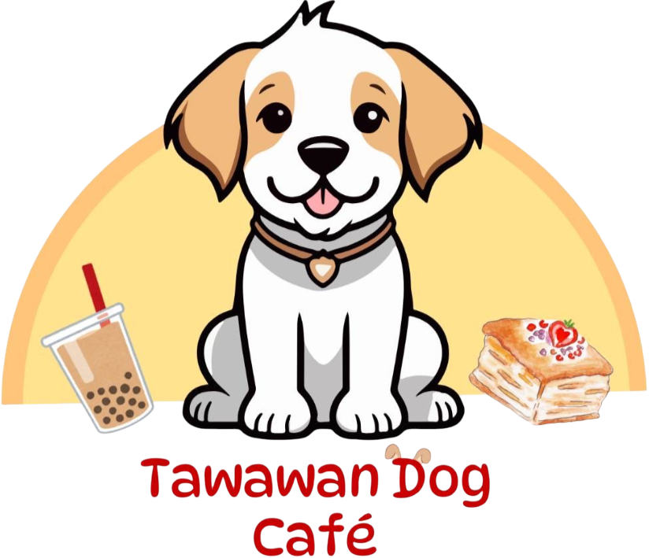

## Tawawan Dog Café 

โปรเจกต์นี้เป็นส่วนหนึ่งของรายวิชา **Fundamental of Database System** และ **Software Process** พัฒนาโดย กลุ่มUP14 จากสาขาวิศวกรรมซอฟต์แวร์ มหาวิทยาลัยพะเยา ปีการศึกษา 2568 เพื่อมุ่งเน้นการพัฒนาซอฟต์แวร์ที่ตอบโจทย์การใช้งานจริงและเสริมสร้างทักษะด้านวิศวกรรมซอฟต์แวร์ให้กับนักศึกษา

## รายละเอียดโครงการ
**Tawawan Dog Café** พัฒนาขึ้นเพื่อเพิ่มประสิทธิภาพการจัดการร้านกาแฟสุนัข โดยระบบสามารถจัดการโต๊ะลูกค้า เมนูอาหารและเครื่องดื่ม ติดตามสถานะออเดอร์ และจัดทำรายงานสรุปยอดขาย ช่วยให้เจ้าของร้านและพนักงานบริหารจัดการร้านได้ง่ายและสะดวกยิ่งขึ้น

---
## ที่มาและความสำคัญ
ปัจจุบันร้านคาเฟ่ได้รับความนิยมสูง แต่กลับเผชิญปัญหาการจัดการ คำสั่งซื้อ เช่น การจดออเดอร์ผิดพลาด ลูกค้ารอคิวนาน และการชำระเงินล่าช้า ส่งผลให้ประสบการณ์ของลูกค้าลดลง เพื่อแก้ไขปัญหาเหล่านี้จึงได้พัฒนา “ระบบสั่งอาหารและเครื่องดื่มผ่านเว็บไซต์” ที่ช่วยให้ลูกค้าสามารถดูเมนู สั่ง และชำระเงินได้ด้วยตนเอง ลดข้อผิดพลาดในการรับออเดอร์ เพิ่มความรวดเร็วในการให้บริการ และเปิดโอกาสให้เจ้าของร้านจัดการเมนูหรือโปรโมชั่นได้อย่างสะดวก ทั้งยังรองรับการใช้งานผ่าน QR Code ในร้านหรือใช้งานล่วงหน้านอกสถานที่ เพื่อยกระดับมาตรฐานการให้บริการของคาเฟ่ในยุคดิจิทัล.

---
## วัตถุประสงค์
- เพื่อให้ลูกค้าสามารถเข้าถึงร้านค้าได้โดยง่ายโดยไม่ต้องไปสั่งหน้าร้านมีเว็ปไซต์เป็นตัวกลาง
-   เพิ่มยอดขายให้กับผู้ประกอบการร้านอาหารตามสั่ง
-   เว็ปไซตจะช่วยสร้างเสริมภาพลักษณ์ที่น่าเชื่อถือให้กับร้านค้าและดึงดูดลูกค้าเข้ามา

---
## กลุ่มผู้ใช้งานหลัก
**Customer**
-   นักศึกษา
-   ผู้ปกครอง

**Owner**
-   เจ้าของร้านTawawan Dog Café
---

## Table of Contents
- [Tawawan Dog Café](#tawawan-dog-café)
- [รายละเอียดโครงการ](#รายละเอียดโครงการ)
- [ที่มาและความสำคัญ](#ที่มาและความสำคัญ)
- [วัตถุประสงค์](#วัตถุประสงค์)
- [กลุ่มผู้ใช้งานหลัก](#กลุ่มผู้ใช้งานหลัก)
- [Team Job position](#team-job-position)
- [เทคโนโลยีที่ใช้](#เทคโนโลยีที่ใช้)
- [Figma](#figma)
- [Demo](#demo)
- [Contact](#contact)

---

## Team Job position
| **Student ID** | **Name**               | **Position**            |
|-----------------|------------------------|--------------------------|
| 67023008        | Apinya Sanghong        | UX/UI Designer           |
| 67023109        | Inthitanan Pankaew     | Front-End Developer      |
| 67026427        | Pattarawin Rungpanarat | Front-End Developer      |
| 67026449        | Mutsaya Hwangji        | Functional Tester        |

---

## เทคโนโลยีที่ใช้

- **Design:**
  - **Figma** 

- **Frontend:** 
  - **Next.js 13+ (App Router)**   
  - **React**   
  - **JavaScript**   
  - **TailwindCSS** 

- **Database:** 
  - **Supabase** 

---
## Figma
[Fig Tawawan_Dog_Cafe_V.2](https://www.figma.com/design/2wJkQzfOfAY033oJN8Ofo9/Project-G.UP14?node-id=1-2&t=66GEXJLVoQ84awMg-1)

---
## Demo
[Demo Tawawan_Dog_Cafe_V.2](https://tawawan-dog-cafe-v-2.vercel.app/)

---

## Contact
**หากมีคำถาม สามารถติดต่อผู้ดูแลโปรเจคคนที่1ได้ที่:**
  -  อีเมล: naysasatadur5555@gmail.com
  -  GitHub: [https://github.com/pxttxrxwxn](https://github.com/pxttxrxwxn)
**หากมีคำถาม สามารถติดต่อผู้ดูแลโปรเจคคนที่2ได้ที่:**
  -  อีเมล: 67023008@up.ac.th
  -  GitHub: [https://github.com/Pookpikkkkk](https://github.com/Pookpikkkkk)
